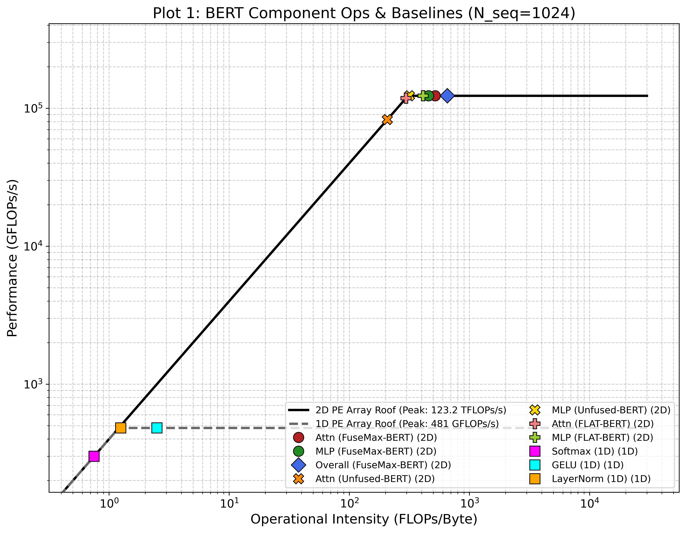
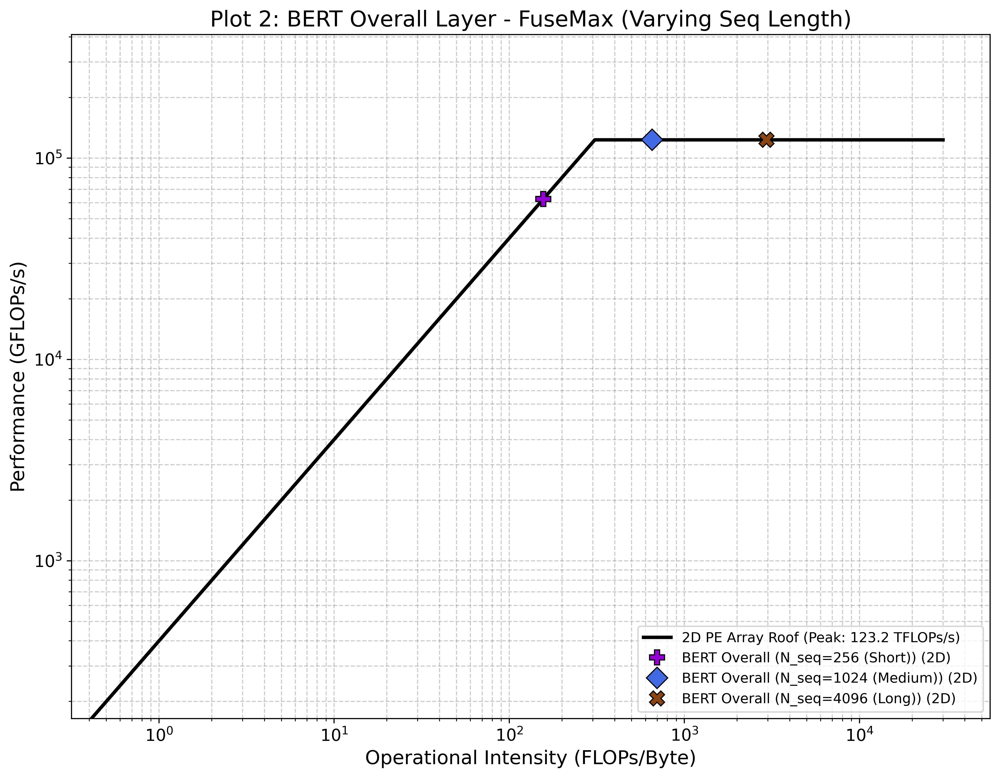
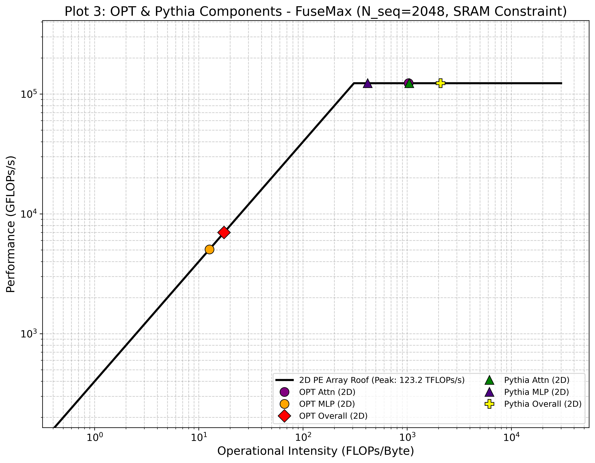
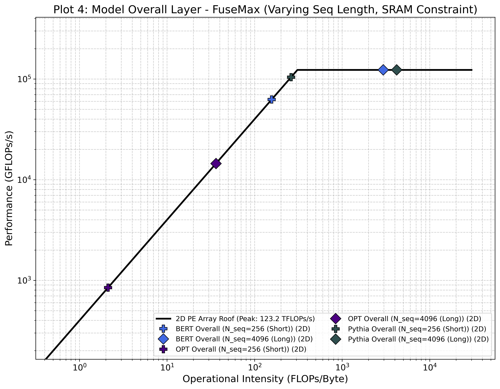
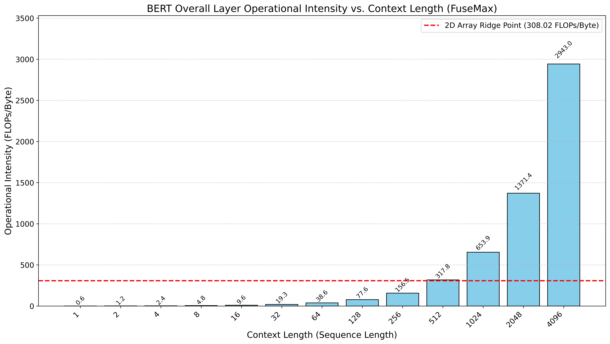

# FuseMax Workload

This is the ENGN2911 final project repository exploring FuseMax's effectiveness across different model sizes and context lengths.

Original paper repository: [micro24-fusemax-artifact](https://github.com/FPSG-UIUC/micro24-fusemax-artifact/tree/main)

## Overview

This project examines how FuseMax performance varies when scaling model parameters and input context lengths.

## Installation 
I have updated the docker config to support both ARM & X86 
Then follow the original [README](./FUSEMAXREADME.md) to set up the docker image.

## Results

# Reproducing results
1. BERT on fusemax with different level of optimization is saved in this [notebook](workspace/notebooks/figs.ipynb). (1k, and 4k length)
2. Pythia-14m on fusemax with different level of optimization is saved in this [notebook](workspace/notebooks/pythia.ipynb)
3. All theoretical roofline is saved in this [notebook](workspace/notebooks/theoreticalroofline.ipynb)
4. Operational intensity vs context length is saved in this [notebook](workspace/notebooks/workloadprogress.ipynb)

# Fibertree
- Our fibertree animation of Einsum tensor distribution to the 2 PE arrays can be seen in this [notebook](https://colab.research.google.com/drive/1YjRYNNHCmqL3Cr9G0U8_xRd__7RVEweO?usp=sharing).
- To run the notebook:
  1. Run block one to install fibertree.
  2. Run block two to create tensors with TensorMaker().
  3. Run block three to see the values from the Einsum tensors sent to the different PEs, as in Figure 5 in the FuseMax paper. Each color that a tile lights up corresponds to a different position on either the 2x2 or 1x2 PE.
  4. Run block three to see the algebra being performed from Cascade 5; each Einsum is created by multiple tensors that are calculated before it. The tiles become highlighted to indicate being sent to different positions on the PEs, as before.

 - Note that Chrome prevents Google Colab from displaying the animation full screen, so you may want to use Safari to view the large fibertree animation.
